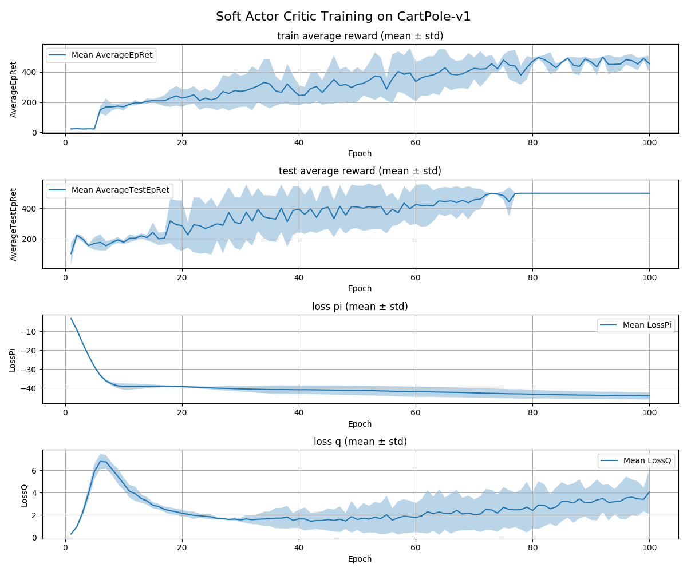

# DeepRL -> Soft Actor Critic

Soft Actor-Critic (SAC) is a deep reinforcement learning algorithm that combines off-policy learning with a maximum 
entropy framework, encouraging exploration while maximizing expected rewards. It is designed to improve learning efficiency and stability compared to traditional methods.

SAC is a model for continuous action space, it has been discretized onto 2 actions, left or right.

We can see that after ~80 steps, the model always got the maximum amount of reward 500. Which implies that the model has
correctly learned a solution to the cartpole problem.
